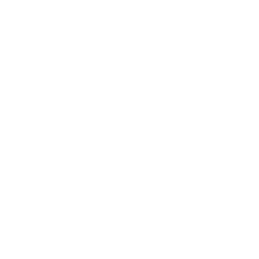

# Advanced WebGL Template Project

 Made as ThreeJS React Fiber with Shader Implementation running on NextJS and WebGL.

  

  

# 
ThreeJS Studio

WE WANT #WebGPU

## Getting Started

adjust `.env`

- run `npm install --include=dev`
- run `npm run dev` to hotreload with turbo from NextJS, make sure to use fragments from react.
- run `npm run build` to build the production version of the app and **serve it using a static server** or use the dist folder for any other purpose like apps 👌
- (OPTIONAL) run `npm run` to see a list of commands, one of them can also publish the app to Vercel, so NextJS runs serverless for free to make it public. any monetization is 100% for ME.. no ok its for you, shit...

## Current State of Development

I have been waiting for webgpu to come out to make use of gpu shaders and/or math.
This hasn't happened in about 5 years...
so i took this project from one of my old repository and formatted it with examples and actual parts to build a solarsystem with shaders through react and react-fiber. using components and using **hooks** to manage state and effects for better performance and reactivity. Take note that we give you a few shell scripts and some binaries and executables. these are all for your shell, i recommend using either linux bash bourne to be exact. on windows use git bash bourne to execute them, they are made so you can comvert a prefab into a actual component by converting that prefab. I want to see people just now when bots are swarming it. making 3d experiences that keeps the bots out. they cannot interact with 3d websites. so if you want to just use this to make some cool landing page. i whish you lots of luck. for myself this template means i can build a game with the right use of tools and fuckit if webgpu is not out yet. I will use webgl and react-three-fiber to make a game.

 Tangent: (taking long with that webgpu aint it? yall already infected our computers with apps that can reach the kernel. why the fuck do we lock the browser from accessing kernel or the os? Does this needs to be addressed for better security practices? then let's lock down the os too! This is a critical discussion that needs to happen.) Sorry mother, Maria Sadina. I will forget my sins and move on. i will never swear again till next time <3

### Refs and Docs
1. [Next.js](https://nextjs.org/docs) for more details.